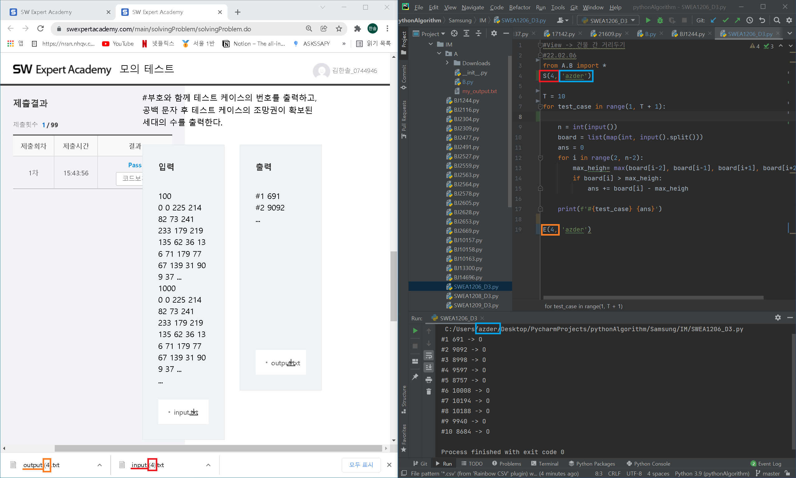
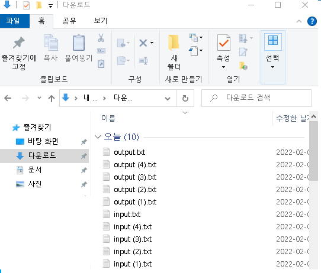
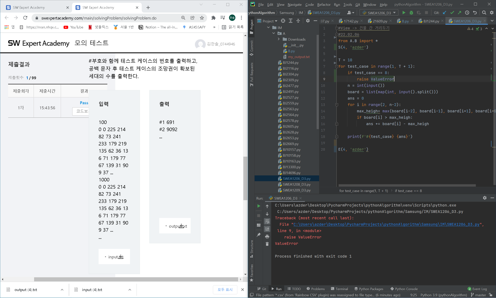
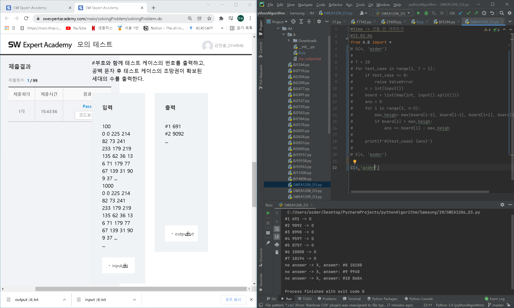
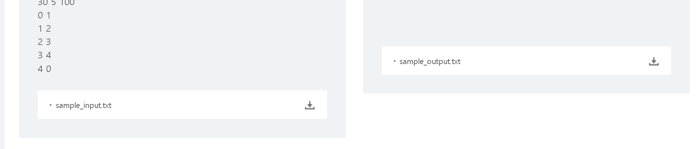

원본 출처 :https://github.com/kuku-forum/Algorithm-study/tree/master/my_package




```
From A.B import *
S(정답 번호, '내 PC 이름')

코드

E(정답 번호, '내 PC 이름')
```

Windows의 경우 input, output 다운로드시 자동으로 Downloads에 순서대로 다운로드.

경로(C:\Users\\'내 pc이름'\Downloads\)

Downloads 폴더 안 input (num).txt output (num).txt 불러 와서 정답 비교






중간에 오류 발생시

```
S(정답 번호, '내 PC 이름')

코드

E(정답 번호, '내 PC 이름')

주석 처리 후

C(정답 번호, '내 PC 이름')
```



오류 발생 전까지 정답 비교




정답 txt이름이 sample_input, sample_output일 경우 S,E,C 3번째 인자에 아무값이나 입력

EX) S(1,'name',1), E(2,'name,'a'), C(3,'name','asdsad)

3번째 인자가 입력을 받을 경우(공백이 아닐 경우) sample_in(out)put 이랑 비교


*

input, ouput, sample_input, sample_out 외에는 비교 불가

파일 이름을 input으로 변경


1. 1번째 인자가 공백 일 경우 input.txt, output.txt 와 비교, 번호 없음 
2. 2번째 인자가 공백 일 경우, A폴더/Downloads 폴더내 in,output과 비교
   - 절대 경로가 다를경우, 드래그앤 드랍후 이용
3.  3번째 인자가 공백 일 경우 input,output과 비교, 공백이 아닐경우  sample_in(out)put.txt 와 비교


사용 예)

함수(num=0, name='', sample_flag='') 

첫번째 인자 input,output 번호

두번쨰 인자 '내 pc 이름' , 입력 안할 시 A\\Downloads 폴더의 txt와 비교

세번째 인자, 입력 안할 시('') in(out)put, 값이 들어올 경우 sampl_in(out)put 과 비교


기본 사용 

S(번호, '내 PC 이름') Downloads(다운로드) 폴더 안 in,out put (번호).txt 비교

S(0, 'name') Downloads(다운로드) 폴더 안 input.txt 비교

S(1, 'name') Downloads(다운로드) 폴더 안 input (1).txt 비교


S(1) A폴더,Downloads input (1).txt 와 비교 

S('','','1') A폴더,Downloads sample_input (1).txt 와 비교 

S(1, '', 1)   A폴더,Downloads sample_input (1).txt 와 비교

S('', 'name') Downloads(pc이름이 name, 다운로드)  input.txt 와 비교

S(1,'name') Downloads(pc이름이 name, 다운로드)  input (1).txt 와 비교

 S(1,'name','아무 값') Downloads(pc이름이 name, 다운로드)  sample_input (1).txt 와 비교


